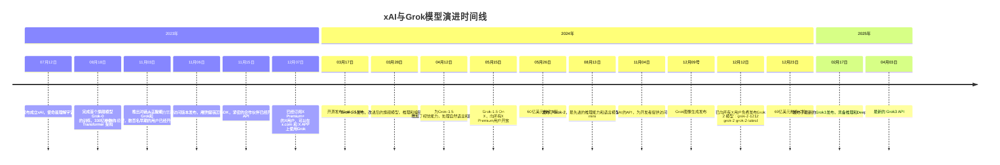

## 四大模型公司

四大：谷歌、OpenAI、Anthropic、xAI


## xAI

可以在 --> [company](https://x.ai/company) 了解 xAI 这家公司。我们都知道马斯克非常喜欢**X**。所以不出意外，在 AI 方面的公司也是叫 x 系列。

2 月 27 日，硅谷科技媒体 The Information 报道，马斯克最近几周一直在接触一些 AI 工程师，打算组建新的 AI 实验室来做 ChatGPT 竞品。

- 公司成立的时间是在：2023 年 7 月 12 日。

《银河系漫游指南》是马斯克非常喜欢的一部科幻小说。xAI 的使命是“理解宇宙的本质，了解人类的存在目的”。这也是《银河系漫游指南》的主题。“42”则是书中一个著名的梗，被称为“生命、宇宙及一切的终极答案”（The Answer to the Ultimate Question of Life, the Universe, and Everything）。

宣布成立的时间是 23（2023 年） + 7 + 12 = 42。选择这天也是特别用心准备的。外媒报道，马斯克其实在 2023 年 3 月份、4 月份就创建了 xAI。

xAI 的使命是：理解宇宙的本质。

从第一性原理出发进行推理 + 没有目标是过于宏伟的 + 快速行动，解决问题

## 专码模型 Grok Code Fast 1

截至 2025 年 11 月 13 日，xAI 发布的 Grok Code Fast 系列只有 Grok Code Fast 1（也称 v1.0）这一个型号。它于 2025 年 8 月 28 日正式推出

## Grok 的服务

xAI API 适合开发者，需要账号和 API 密钥，可以集成到第三方应用，功能最多样；

Grok.com 和移动端应用为普通用户提供 AI 助手功能，界面友好，最新版特性最快上线；

Grok in X 功能较简，突出与 X 平台（推文分析、发帖等）集成，不同的付费体系与功能（用户在 X 上开的会员不会影响 xAI API 的服务，反之亦然）

Grok 目前提供的产品形态整体分为 3 个系列，一个是 X 系列，一个是 xAI 系列（Grok），一个是 API。

- X 系列：

  - 网页版本的 X x.com ，X 平台（原 Twitter）的网页端
  - X App，X 平台的移动端应用 / 之前叫 Twitter APP

- xAI 系列（Grok）：

  - grok.com 网站：独立的 Grok 网页应用
  - Grok iOS 应用：专门的 iOS 移动应用
  - Grok Android 应用：专门的 Android 移动应用

- xAI API：

  - xAI API：面向开发者的 API 接口（https://api.x.ai）

有关账号可以使用你自己的 x 账号来注册。因为虽然说 xAI 是马斯克新的一家公司，不过和 Twitter（现在叫 X）是有十分密切关系的。xAI 的账号可以直接使用 X 账号登录。
像其他平台的话一般可以使用谷歌邮箱，Grok 注册的话推荐使用 X 账号注册。

## 时间线图



## 模型

- Grok 当下的模型名称相对简单一些。需要注意的是有一些模型已经弃用，比如 grok beta。

## API

API 的形式会晚于模型的发布。比如在 2025 年 4 月 1 号的时候，grok 最新的 api 是 grok-2-1212，因为 grok3 的 API 还没发布。

- 2024-08 马斯克在 2024 年 8 月确认了提供 API 的计划
- 2024-10-22 Grok 模型的 API 访问最早于 2024 年 10 月 22 日由埃隆·马斯克的人工智能公司 xAI 正式发布
- 2024-10 正式推出了名为“grok-beta”的 API 模型，用户需要登录 xAI 账户申请访问权限
- 2025-4 逐步开放了 Grok 3 API 接口服务

## 周期性分析

```sh
公司成立 → Grok-0：1.2个月 （快速启动期）
Grok-0 → Grok-1：2.5个月 （初期迭代）
Grok-1 → Grok-1.5：4.8个月 （成熟期开始）
Grok-1.5 → Grok-2：4.5个月 （稳定周期）
Grok-2 → Grok-3：6.2个月 （复杂功能期）
Grok-3 → Grok-4：4.7个月 （回归稳定）
```

```sh
🔄 周期性规律
初期快速迭代：前两个版本间隔较短（1-2个月）
中期稳定周期：进入4-5个月的相对稳定发布周期
偶有延长：Grok-2到Grok-3耗时最长（6.2个月），可能因为功能复杂度增加
趋于稳定：整体趋势是4-5个月的发布周期
```


